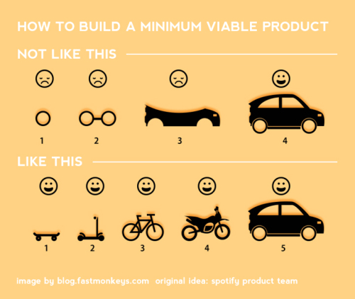

  
```{r child = "setup.Rmd"}
```

```{r, include=FALSE}
library(tidyverse)
library(rvest)
library(lubridate)
theme_set(theme_minimal())
```

  
# Motivation

*  Logic (and data...) should live in only one place
*  Abstraction and isolation
*  Clarity

--

*  As an interpreted, interactive language, the __process__ for writing functions is as important as the laws and syntax of R 

---

```{r}

```


---

## Load the Gapminder data

[Gapminder](https://www.gapminder.org/about/) is a Swedish foundation that combats misconceptions about global development.  These are just a tiny exerpt of the full data available there -- containing populaton, life expectancy, deflated GDP per capita in $USD.

```{r start_func1}
library(gapminder)
glimpse(gapminder)
```

---

```{r}
ggplot(gapminder, aes(x = year, y = lifeExp, color = continent))  + 
  geom_line(aes(group = country), alpha = .5) + scale_color_brewer(type = 'qual') + 
  geom_boxplot(data = filter(gapminder, year %in% seq(from=1952, to = 2002, by = 20)), 
               aes(group = interaction(year,continent)), 
               width = 8, outlier.shape = NA, position = 'dodge') 
```

---

## Max - min

You've got a numeric vector--`lifeExp` or `pop` or `gdpPercap` -- and you want to compute the difference between its max and min. Perhaps you want to do this after you  slice up the Gapminder data by year, country, continent, or combinations thereof.

---

## Get something that works

First, develop some working .alert[code for interactive use, using a representative input], say `lifeExp`.

R functions that will be useful: `min()`, `max()`, `range()`:

```{r}
min(gapminder$lifeExp)
max(gapminder$lifeExp)
range(gapminder$lifeExp)
```

---

## Some natural solutions

```{r}
max(gapminder$lifeExp) - min(gapminder$lifeExp)
range(gapminder$lifeExp)[2] - range(gapminder$lifeExp)[1]
range(gapminder[['lifeExp']])[2] - range(gapminder[['lifeExp']])[1]
diff(range(gapminder$lifeExp))
```

Internalize this "answer" because our informal testing relies on you noticing departures from this.

---

### Skateboard $\gg$ perfectly formed rear-view mirror

.pull-left[

Build [that skateboard](https://en.wikipedia.org/wiki/Minimum_viable_product) before you build the car or some fancy car part. A limited-but-functioning thing is useful to learn the dimensions of a problem.

This is related to the [Telescope Rule](https://wiki.c2.com/?TelescopeRule)

> It is faster to make a four-inch mirror then a six-inch mirror than to make a six-inch mirror.

]
.pull-right[
```{r spotify-howtobuildmvp, echo = FALSE, out.width = "100%"}

```
.small[[From your ultimate guide to Minimum Viable Product ](https://blog.fastmonkeys.com/2014/06/18/minimum-viable-product-your-ultimate-guide-to-mvp-great-examples). Image attributed to the Spotify team]

]

---

## Turn the working interactive code into a function

Add NO new functionality! Just write your very first R function.

```{r}
max_minus_min = function(x){
  max(x) - min(x)
}
max_minus_min(gapminder$lifeExp)
```

Check that you're getting the same answer as you did with your interactive code. Test it eyeball-o-metrically at this point.

---

## Test your function

### Test on new inputs

Pick some new artificial inputs where you know (at least approximately) what your function should return.

```{r}
max_minus_min(1:10)
max_minus_min(runif(1000))
```

I know that 10 minus 1 is 9. I know that random uniform [0, 1] variates will be between 0 and 1. Therefore max - min should be less than 1. If I take LOTS of them, max - min should be pretty close to 1.

It is intentional that I tested on integer input as well as floating point. Likewise, I like to use valid-but-random data for this sort of check.

---

### Test on real data but *different* real data

Back to the real world now. Two other quantitative variables are lying around: `gdpPercap` and `pop`. Let's have a go.

```{r}
max_minus_min(gapminder$gdpPercap)
max_minus_min(gapminder$pop)
```

Either check these results "by hand" or apply the "does that even make sense?" test.

---

### Test on weird stuff

Now we try to break our function. Don't get truly diabolical (yet). Just make the kind of mistakes you can imagine making at 2am when, 3 years from now, you rediscover this useful function you wrote. Give your function inputs it's not expecting.

```{r error = TRUE}
max_minus_min(gapminder) ## hey sometimes things "just work" on data.frames!
max_minus_min(gapminder$country) ## factors are kind of like integer vectors, no?
max_minus_min("eggplants are purple") ## i have no excuse for this one
```

How happy are you with those error messages? You must imagine that some entire __script__ has failed and that you were hoping to just `source()` it without re-reading it. If a colleague or future you encountered these errors, do you run screaming from the room? How hard is it to pinpoint the usage problem?

---

### I will scare you now

Here are some great examples STAT545 students devised during class where the function __should break but it does not.__

```{r}
max_minus_min(gapminder[c('lifeExp', 'gdpPercap', 'pop')])
max_minus_min(c(TRUE, TRUE, FALSE, TRUE, TRUE))
```

In both cases, R's eagerness to make sense of our requests is unfortunately successful. In the first case, a data.frame containing just the quantitative variables is eventually coerced into numeric vector. We can compute max minus min, even though it makes absolutely no sense at all. In the second case, a logical vector is converted to zeroes and ones, which might merit an error or at least a warning.

---

## Check the validity of arguments

For functions that will be used again -- which is not all of them! -- it is good to check the validity of arguments. This implements a rule from [the Unix philosophy][unix-philosophy]:

> Rule of Repair: When you must fail, fail noisily and as soon as possible.

---

### `stopifnot()`

I use it here to make sure the input `x` is a numeric vector.

```{r error = TRUE}
mmm = function(x) {
  stopifnot(is.numeric(x))
  max(x) - min(x)
}
mmm(gapminder)
mmm(gapminder$country)
mmm("eggplants are purple")
mmm(gapminder[c('lifeExp', 'gdpPercap', 'pop')])
mmm(c(TRUE, TRUE, FALSE, TRUE, TRUE))
```

And we see that it catches all of the self-inflicted damage we would like to avoid.

---

### if then stop

`stopifnot()` doesn't provide a very good error message. The next approach is very widely used. Put your validity check inside an `if()` statement and call `stop()` yourself, with a custom error message, in the body.

```{r error = TRUE}
mmm2 = function(x) {
  if(!is.numeric(x)) {
    stop('I am so sorry, but this function only works for numeric input!\n',
         'You have provided an object of class: ', class(x)[1])
  }
  max(x) - min(x)
}
mmm2(gapminder)
```

---

In addition to a gratuitous apology, the error raised also contains two more pieces of helpful info:
  
* *Which* function threw the error.
* Hints on how to fix things: expected class of input vs actual class.

If it is easy to do so, I highly recommend this template: "you gave me THIS, but I need THAT".

The tidyverse style guide has a very useful [chapter on how to construct error messages](https://style.tidyverse.org/error-messages.html).

Also use `stopifnot` for checks in data analytical scripts!

---

## Wrap-up and what's next?

Here's the function we've written so far:

```{r end_func1}
mmm2
```

---


## Resources

Packages for runtime assertions (the last 3 seem to be under more active development than `assertthat`):

* assertthat on [CRAN][assertthat-cran] and [GitHub][assertthat-github] - *the Hadleyverse option*
* ensurer on [CRAN][ensurer-cran] and [GitHub][ensurer-github] - *general purpose, pipe-friendly*
* assertr on [CRAN][assertr-cran] and [GitHub][assertr-github] - *explicitly data pipeline oriented*
* assertive on [CRAN][assertive-cran] and [Bitbucket][assertive-bitbucket] - *rich set of built-in functions*

Hadley Wickham's book [Advanced R][adv-r] [-@wickham2015a]:

* Section on [defensive programming][adv-r-defensive-programming]

---
class: middle

.hand[What is an R function]

---

## Turn your code into a function

- Pick a short but informative **name**, preferably a verb.

<br>
<br>
<br>
<br>

```{r eval=FALSE}
scrape_speech = 
  
  
  
  
  
  
```

---

## Turn your code into a function

- Pick a short but evocative **name**, preferably a verb.
- List inputs, or **arguments**, to the function inside `function`. If we had more the call would look like `function(x, y, z)`.

<br>

```{r eval=FALSE}
scrape_speech = function(x){
  
  
  
  
  
}  
```

---

## Turn your code into a function

- Pick a short but informative **name**, preferably a verb.
- List inputs, or **arguments**, to the function inside `function`. If we had more the call would look like `function(x, y, z)`.
- Place the **code** you have developed in body of the function, a `{` block that immediately follows `function(...)`.

```{r eval=FALSE}
scrape_speech = function(url){

  # code we developed earlier to scrape info 
  # on single art piece goes here
  
}
```

---

## `scrape_speech()`

.pull-left-wide[
.small[
```{r}
scrape_speech = function(url) {
  
  speech_page = read_html(url)

  title = speech_page %>%
    html_node(".article-header__title") %>%
    html_text()

  date = speech_page %>%
    html_node(".content-data__list:nth-child(1) strong") %>%
    html_text() %>%
    dmy()

  location = speech_page %>%
    html_node(".content-data__list+ .content-data__list strong") %>%
    html_text()

  abstract = speech_page %>%
    html_node(".leader--first-para p") %>%
    html_text()

  text = speech_page %>%
    html_nodes("#preamble p") %>%
    html_text() %>%
    list()

  tibble(
    title = title, date = date, location = location,
    abstract = abstract, text = text, url = url
  )
}
```
]
]


---

class: middle

# Writing functions

---

## What goes in / what comes out?

.pull-left-wide[
- They take input(s) defined in the function definition

```{r eval=FALSE}
function([inputs separated by commas]){
  # what to do with those inputs
}
```

- By default they return the last value computed in the function

```{r eval=FALSE}
scrape_page = function(x){
  # do bunch of stuff with the input...
  
  # return a tibble
  tibble(...)
}
```

- You can define more outputs to be returned in a list as well as nice print methods (but we won't go there for now...)
]

---

.question[
What is going on here?
]

```{r}
add_2 = function(x){
  x + 2
  1000
}
```

```{r}
add_2(3)
add_2(10)
```

---

## Naming functions

> "There are only two hard things in Computer Science: cache invalidation and naming things." - Phil Karlton

---

## Naming functions

- Names should be short but clearly evoke what the function does

--
- Names should be verbs, not nouns

--
- Multi-word names should be separated by underscores (`snake_case` as opposed to `camelCase`)

--
- A family of functions should be named similarly (`scrape_page()`, `scrape_speech()` OR `str_remove()`, `str_replace()` etc.)

--
- Avoid overwriting existing (especially widely used) functions

```{r eval=FALSE}
# JUST DON'T
mean = function(x){ 
  x * 3 
  }
```

---

# Acknowledgments

Adapted from Jenny Bryan's STAT545 https://stat545.com/functions-part1.html and data science in a box.
